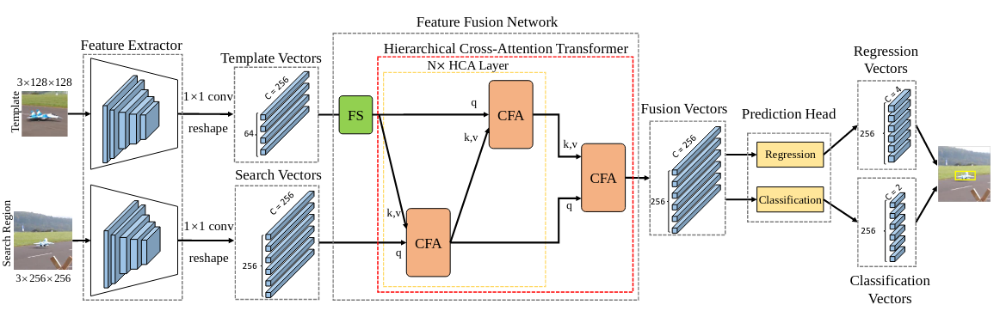
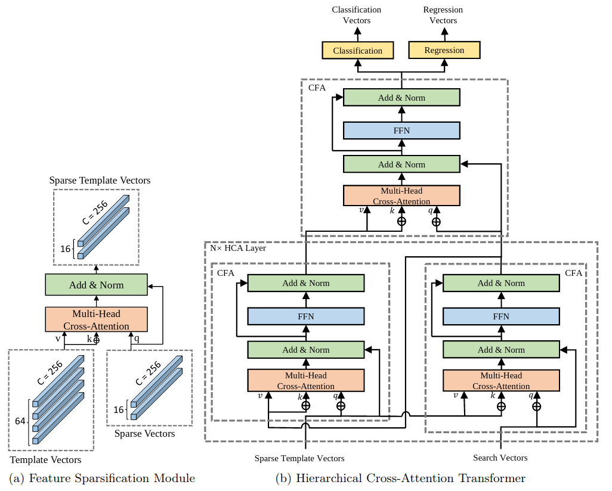

# HCAT
Official implementation of the HCAT , including training code and trained models.

## Tracker

**HCAT [model](https://drive.google.com/drive/folders/1kcYIb1WMDWo6_96cfN2YwpijcJZp1CIJ?usp=sharing)**

In this work, we present an efficient tracking method via a hierarchical cross-attention transformer named HCAT. Our model runs about 195 f ps on GPU, 45 fps on CPU, and 55 fps on the edge AI platform of NVidia Jetson AGX Xavier. Experiments show that our HCAT achieves promising results on LaSOT, GOT-10k,TrackingNet, NFS, OTB100, UAV123, and VOT2020.





## Results

|      **Model**       | **LaSOT<br>AUC(%) ** | **TrackingNet<br>**AUC(%) | GOT-10k<br/>AO (%) | **Speed-GPU<BR>(fps)** | **Speed-CPU<BR>(fps)** | **Speed-AGX<br>(fps)** |
| :------------------: | :------------------: | :-----------------------: | :----------------: | :--------------------: | :--------------------: | :--------------------: |
|     Res18_N1_q16     |         57.9         |           74.2            |        61.3        |          240           |           46           |           69           |
|     Res18_N2_q16     |         59.1         |           76.6            |        65.3        |          195           |           45           |           55           |
|     Res50_N2_q16     |         59.1         |           77.9            |        67.8        |          115           |           22           |           42           |
|  Lighttrack_N2_q16   |         59.8         |           76.6            |        66.3        |          100           |           45           |           34           |
| Convnext_tiny_N2_q16 |         63.1         |           80.5            |        70.1        |          136           |           21           |           34           |

* The reported speed is the speed of the model itself, and does not include pre- and post-processing of the image(e.g., cropping the search region)

## Installation

This document contains detailed instructions for installing the necessary dependencied for **HCAT**. The instructions 
have been tested on Ubuntu 18.04 system.

#### Install dependencies
* Create and activate a conda environment 
```bash
conda create -n hcat python=3.7
conda activate hcat
```
* Install PyTorch
```bash
conda install -c pytorch pytorch=1.5 torchvision=0.6.1 cudatoolkit=10.2
```

* Install other packages
```bash
conda install matplotlib pandas tqdm
pip install opencv-python tb-nightly visdom scikit-image tikzplotlib gdown timm
conda install cython scipy
sudo apt-get install libturbojpeg
pip install pycocotools jpeg4py
pip install wget yacs
pip install shapely==1.6.4.post2
```
* Install onnx and onnxruntime
* Here the version of onnxruntime-gpu needs to be compatible to the CUDA  version and CUDNN version on the machine. For more details, please refer to https://www.onnxruntime.ai/docs/reference/execution-providers/CUDA-ExecutionProvider.html . For example, on my computer, CUDA version is 10.2, CUDNN version is 8.0.3, so I choose onnxruntime-gpu==1.6.0

```
pip install onnx onnxruntime-gpu==1.6.0
```


* Setup the environment                                                                                                 
  Create the default environment setting files.

```bash
# Change directory to <PATH_of_HCAT>
cd HCAT

# Environment settings for pytracking. Saved at pytracking/evaluation/local.py
python -c "from pytracking.evaluation.environment import create_default_local_file; create_default_local_file()"

# Environment settings for ltr. Saved at ltr/admin/local.py
python -c "from ltr.admin.environment import create_default_local_file; create_default_local_file()"
```
You can modify these files to set the paths to datasets, results paths etc.
* Add the project path to environment variables  
Open ~/.bashrc, and add the following line to the end. Note to change <path_of_HCAT> to your real path.
```
export PYTHONPATH=<path_of_HCAT>:$PYTHONPATH
```
* Download the pre-trained networks  
  Download the network for [HCAT](https://drive.google.com/drive/folders/1kcYIb1WMDWo6_96cfN2YwpijcJZp1CIJ?usp=sharing) and put it in the directory set by "network_path" in "pytracking/evaluation/local.py". By default, it is set to pytracking/networks.

## Quick Start

#### TRAINING
* Modify [local.py](ltr/admin/local.py) to set the paths to datasets, results paths etc.
* Runing the following commands to train the HCAT. You can customize some parameters by modifying [hcat.py](ltr/train_settings/hcat/hcat.py)
```bash
conda activate hcat
cd HCAT/ltr
python run_training.py hcat hcat 
# for ddp
# python run_training_ddp.py hcat hcat --local_rank 4
```

#### Convert Model

* Convert model to onnx

```
conda activate hcat
cd HCAT/pysot_toolkit
python pytorch2onnx.py
```


#### Evaluation

* We integrated [PySOT](https://github.com/STVIR/pysot) for evaluation. You can download json files in [PySOT](https://github.com/STVIR/pysot) or [here](https://drive.google.com/file/d/1PItNIOkui0iGCRglgsZPZF1-hkmj7vyv/view?usp=sharing).

  For pytorch model,  You need to specify the path of the model and dataset in the [test.py](pysot_toolkit/test.py ).
    ```python
    net_path = '/path_to_model' #Absolute path of the model
    dataset_root= '/path_to_datasets' #Absolute path of the datasets
    ```

    Then run the following commands

    ```bash
    conda activate hcat
    cd HCAT
    python -u pysot_toolkit/test.py --dataset <name of dataset> --name 'HCAT' #test tracker #test tracker
    python pysot_toolkit/eval.py --tracker_path results/ --dataset <name of dataset> --num 1 --tracker_prefix 'hcat' #eval tracker
    ```

  For onnx model,  You need to specify the path of the model and dataset in the [test_onnx.py](pysot_toolkit/test_onnx.py ).

    ```python
  backbone_path = '/path_to_backbone' #Absolute path of the backbone
  model_path = '/path_to_model' #Absolute path of the model
  dataset_root= '/path_to_datasets' #Absolute path of the datasets
    ```

    Then run the following commands

    ```bash
  conda activate hcat
  cd HCAT
  python -u pysot_toolkit/test_onnx.py --dataset <name of dataset> --name 'HCAT' #test tracker #test tracker
  python pysot_toolkit/eval.py --tracker_path results/ --dataset <name of dataset> --num 1 --tracker_prefix 'hcat' #eval tracker
    ```

  The testing results will in the current directory(results/dataset/hcat/)

* You can also use [pytracking](https://github.com/chenxin-dlut/HCAT/blob/main/pytracking) to test and evaluate tracker. The results might be slightly different with [PySOT](https://github.com/STVIR/pysot) due to the slight difference in implementation (pytracking saves  results as integers, pysot toolkit saves the results as decimals).

#### Getting Help

If you meet problem, please try searching our Github issues, if you can't find solutions, feel free to open a new issue.

- `ImportError: cannot import name region`

Solution: You can just delete `from pysot_toolkit.toolkit.utils.region import vot_overlap, vot_float2str` in [test.py](https://github.com/chenxin-dlut/HCAT/blob/main/pysot_toolkit/test.py) if you don't test VOT2019/18/16. You can also build `region` by `python setup.py build_ext --inplace` in [pysot_toolkit](https://github.com/chenxin-dlut/HCAT/blob/main/pysot_toolkit).

## Acknowledgement

This is a modified version of the python framework [PyTracking](https://github.com/visionml/pytracking)  and  [Transt](https://github.com/chenxin-dlut/TransT) based on **Pytorch** , also borrowing from [PySOT](https://github.com/STVIR/pysot) and [GOT-10k Python Toolkit](https://github.com/got-10k/toolkit). We would like to thank their authors for providing great frameworks and toolkits.
## Contact

* Xin Chen (email:chenxin3131@mail.dlut.edu.cn)
* Ben Kang(email:kangben@mail.dlut.edu.cn)
